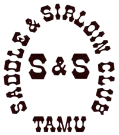

#  README 

##  Introduction

This is an application that assists in managing user attendance of organization events, as well as all users within the organization. It offers features to view announcements and events through Google Calendar API and user authentication with Google Oauth. Users are able to sign-in to events via generated QR codes and have their attendance tallied and compared to the points baseline. For additional security, a queue system is implemented, allowing officers to approve new users after the creation of an account or the start of a new year. The yearly reset, only initiated by the President & Vice-President, will 'reset' the application, giving the website a clean slate for the year by deleting all announcements, deactivating all current events, resetting attendance points, and demoting and kicking all users out of the website other than the President and Vice-President.

https://user-images.githubusercontent.com/112124748/235284125-58cea54f-4623-41cd-ac77-cef729166235.mp4


## 🕮 Table of Contents

1. [📃 Requirements](#-requirements)
2. [📬 External Dependencies](#-external-deps)
3. [📂 Installation](#-installation)
4. [🧪 Tests](#-tests)
5. [🔨 Execute Code](#-execute-code)
6. [🚀 Deployment](#-deployment)
7. [🔬 CI/CD](#-cicd)
8. [🙏🏻 Support](#-support)

## 📃 Requirements

This code has been run and tested on:

-    Ruby - 3.1.2
-    Rails - 7.0.3
-    Ruby Gems - Listed in `Gemfile`
-    PostgreSQL - 13
-    Docker (Latest Container)

## 📬 External Deps

-    Docker - Download latest version at https://www.docker.com/products/docker-desktop
-    Heroku CLI - Download latest version at https://devcenter.heroku.com/articles/heroku-cli
-    Git - Downloat latest version at https://git-scm.com/book/en/v2/Getting-Started-Installing-Git
-    GitHub Desktop (Not needed, but HELPFUL) at https://desktop.github.com/

## 📂 Installation

Download this code repository by using git:

```
git clone https://github.com/victoriapham1/saddle-and-sirloin-tracker
```

## 🧪 Tests

An RSpec test suite is available and can be ran using:

```
rspec spec/
```

You can run all the test cases by running

```
rspec .
```

This will run both the unit and integration tests.

## 🔨 Execute Code

Run the following code in Powershell if using windows or the terminal using Linux/Mac

```
cd saddle-and-sirloin-tracker

docker run --rm -it --volume "${PWD}:/csce431" -e DATABASE_USER=test_app -e DATABASE_PASSWORD=test_password -p 3000:3000 paulinewade/csce431:latest
```

Install the app

```
bundle install && rails webpacker:install && rails db:create && db:migrate
```

Run the app

```
rails server --binding:0.0.0.0
```

The application can be seen using a browser and navigating to http://localhost:3000/

## 🚀 Deployment

Customer App: https://tamusaddleandsirloinclub.herokuapp.com/

Maintenance Document: <br>
https://docs.google.com/document/d/1u4u-mGnNX-hqRsXlfHhtP1DfxZOBIDun0lZXv-LoDD8/edit?usp=sharing

Frequently Asked Questions (FAQs): <br>
https://docs.google.com/document/d/1L5E4ziKvztepu8qj2xLU5Z-FbVlRUrlHFUvzqmrZwAs/edit?usp=sharing

## 🔬 CI/CD

For Continuous Integration, a workflow was generated to run with Rspec, Rubocop, and Brakeman for every push and pull requests.

For Continuous Deployment, the app will auto-deploy on the test and main branch after Continuous Integration has passed on the Heroku platform.

## 🙏🏻 Support

For additional questions or assistance, please contact the development team below.

-   Product Owner: [Victoria Pham](mailto:vtp283@tamu.edu)
-   Scrum Master: [Evan Burriola](mailto:evanburriola12@tamu.edu)
-   Development Team: Bernardo Gonzalez, Justin Chai, Evan Burriola, Victoria Pham
